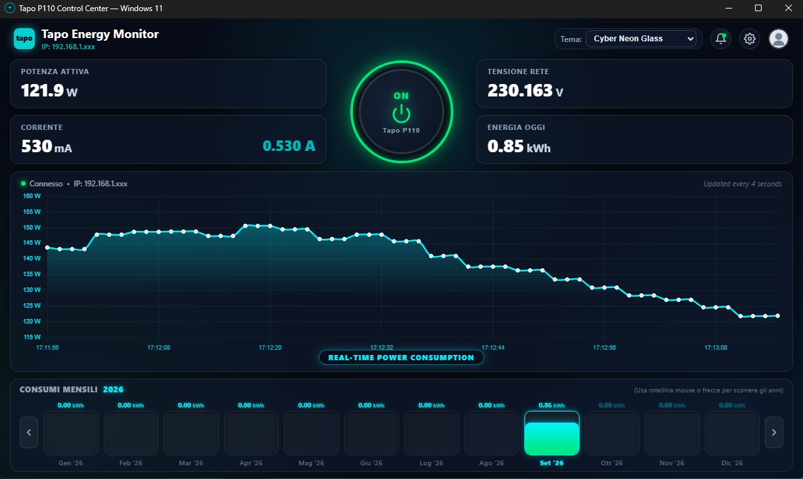
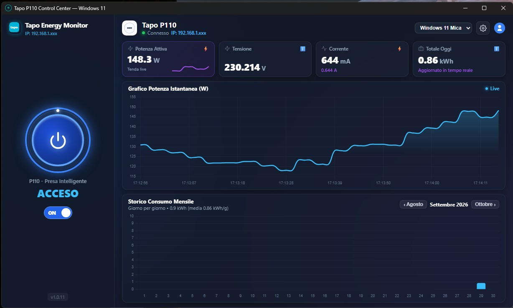
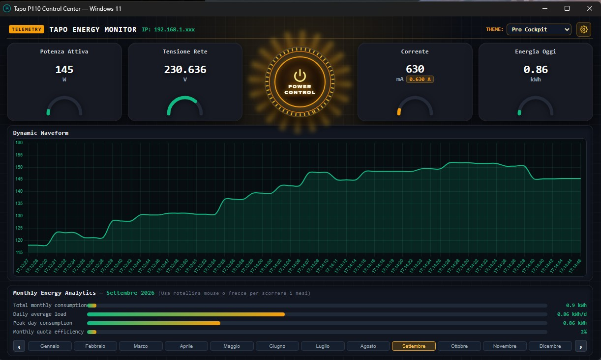

# ⚡ Tapo P110 Control Center per Windows 10/11

<div align="center">


**Un'applicazione moderna, reattiva e autonoma per Windows 10/11 per monitorare e controllare la presa domotica intelligente TP-Link Tapo P110.**

[Funzionalità](#-funzionalità-principali) • [Temi Grafici](#-temi-grafici-intercambiabili) • [Installazione & Avvio](#-installazione--avvio) • [Generazione .EXE](#-generazione-file-exe) • [Licenza & Autore](#-licenza--copyright)

</div>

---

## 📸 Anteprima Interfaccia e Temi Grafici

L'applicazione include **3 differenti temi grafici esclusivi**, commutabili istantaneamente in tempo reale senza ricaricare la pagina:

### 1. Opzione A: "Cyber Neon Glassmorphism" *(Predefinito - Consigliato)*
> Estetica dark moderna con sfondo deep obsidian, pannelli in frosted glass, glow fluorescente ciano/verde neon e anello centrale rotante ad alta intensità.



---

### 2. Opzione B: "Windows 11 Fluent Mica / Luxury Clean"
> Pienamente integrato nello stile di Windows 11 Fluent Design con effetto Mica traslucido, palette blu cobalto e viola sfumato, angoli morbidi e pulsante tattile 3D.



---

### 3. Opzione C: "Pro Cockpit / Industrial High-Tech"
> Cruscotto di telemetria industriale ad alta visibilità con trama carbonio/grafite, accenti ambra dorata ed elementi visivi a quadrante tecnico.



---

## 🌟 Funzionalità Principali

- 🔘 **Grande Pulsante Circolare Power ON/OFF**:
  - Controllo istantaneo della presa con anello a LED animato e feedback visivo dello stato di accensione.
- ⚡ **Azzeramento Istantaneo a Presa Spenta (OFF)**:
  - Appena la presa viene disattivata, le metriche a display (**Potenza W**, **Corrente mA/A**, **Tensione V**) e la curva del grafico live crollano istantaneamente a **0.0**, eliminando letture obsolete o valori residui.
- ⏱️ **Campionamento ad Alta Precisione (ogni 4 secondi)**:
  - Quando la presa è accesa, interroga i registri hardware reali leggendo:
    * **Potenza Attiva ($W$)** con lettura ADC
    * **Tensione di Rete ($V$)** con precisione metrologica a 3 decimali
    * **Corrente Assorbita ($mA$ e $A$)** con **doppia visualizzazione simultanea**
    * **Totale Cumulato Giornaliero ($kWh$)**
- 🪟 **Desktop Gadget Flottante & System Tray**:
  - Mini widget sempre in primo piano sul desktop per monitorare lo stato in ogni momento e ripristinare la dashboard.
- 📈 **Grafico Assorbimento con Autoscaling Dinamico**:
  - La scala Y si adatta automaticamente all'intervallo di assorbimento: anche piccoli carichi (es. 5W con micro-variazioni di 0.3W) generano onde chiare e visibili senza appiattirsi.
- 📅 **Andamento Mensile & Navigatore Mesi**:
  - Grafico a barre interattivo giorno per giorno per il mese visualizzato.
  - Pulsantini `◄ Indietro` e `Avanti ►` per scorrere tra tutti i mesi dell'anno (**Gennaio, Febbraio, Marzo, Aprile, ...**).
  - Selettore rapido per la **Panoramica Annuale (12 Mesi Completi)**.
- 🖥️ **Interfaccia a Schermo Pieno Senza Scroll**:
  - Layout compatto e ingegnerizzato per visualizzare cruscotto comandi, metriche e entrambi i grafici affiancati senza necessità di scorrimento verticale.
- 🧪 **Modalità Simulazione / Demo Integrata**:
  - Permette di esplorare grafici, animazioni e comandi anche senza collegare una presa fisica alla rete locale.
- 🪟 **Doppia Modalità di Esecuzione Windows 11**:
  - Finestra desktop dedicata senza cornici del browser (PyWebView) con apertura centrata a schermo.
  - WebApp accessibile via browser locale all'indirizzo `http://127.0.0.1:8000`.

---

## 📂 Struttura del Progetto

```
Tapo P110/
│
├── core/
│   ├── config.py              # Gestione configurazione persistente e compatibilità PyInstaller
│   ├── database.py            # Database SQLite per storico campionamenti e consumi mensili
│   └── tapo_service.py        # Driver Tapo P110, loop di polling 4s, simulatore demo
│
├── static/
│   ├── css/
│   │   ├── base.css           # Layout compatto a zero scroll
│   │   ├── theme-cyber.css    # Tema A: Cyber Neon
│   │   ├── theme-fluent.css   # Tema B: Windows 11 Mica
│   │   └── theme-cockpit.css  # Tema C: Pro Cockpit
│   ├── js/
│   │   ├── app.js             # Logica UI, autoscaling grafico, websocket e navigazione mesi
│   │   └── chart.umd.min.js   # Libreria Chart.js integrata offline al 100%
│   ├── gadget.html            # Desktop Gadget compatto sempre in primo piano
│   └── index.html             # Interfaccia grafica completa della Dashboard
│
├── Icona/
│   ├── icon.ico               # Icona ufficiale Windows per la WebApp e l'eseguibile
│   └── icon.png               # Asset ad alta risoluzione 256x256
│
├── ScreeShot/                 # Screenshot ufficiali dei 3 temi grafici
│   ├── tema_cyber_neon.jpg
│   ├── tema_fluent_mica.jpg
│   └── tema_pro_cockpit.jpg
│
├── main.py                    # Server FastAPI, WebSocket e launcher finestra desktop
├── GeneraExe.py               # Compilatore PyInstaller per pacchetto standalone .EXE
├── Avvia_App.bat              # Script per avvio immediato con 1 clic
├── requirements.txt           # Dipendenze Python
├── LICENSE                    # Licenza d'uso del software
└── README.md                  # Documentazione ufficiale GitHub
```

---

## 🚀 Installazione & Avvio

### 1. Avvio Rapido con 1 Clic (Consigliato)
Fai doppio clic sul file:
```cmd
Avvia_App.bat
```
Lo script configurerà automaticamente l'ambiente virtuale `.venv` (se non presente), installerà le dipendenze e avvierà la finestra desktop.

### 2. Avvio Manuale da Sorgenti
1. Clona o scarica il repository:
   ```bash
   git clone https://github.com/AngoloInformatico/Tapo-P110-Control-Center.git
   cd "Tapo P110"
   ```
2. Crea e attiva l'ambiente virtuale:
   ```powershell
   python -m venv .venv
   .\.venv\Scripts\Activate.ps1
   ```
3. Installa le dipendenze:
   ```powershell
   pip install -r requirements.txt
   ```
4. Avvia l'applicazione:
   ```powershell
   python main.py
   ```
   *(Oppure avvia in modalità solo Web Server con `python main.py --server` e apri `http://127.0.0.1:8000`)*.

---

## ⚙️ Configurazione della Presa Tapo P110

1. All'interno della WebApp, tocca l'icona delle **Impostazioni** (ingranaggio in alto a destra).
2. Inserisci:
   - **Indirizzo IP Locale**: es. `192.168.1.150` (leggibile dall'app Tapo sullo smartphone in *Impostazioni presa > Informazioni dispositivo*).
   - **Email account Tapo / TP-Link**: la tua email di accesso.
   - **Password account Tapo**: la tua password.
3. Clicca su **"Salva e Connetti"**.

> [!IMPORTANT]
> **Requisito App Tapo (Android / iOS)**:  
> Per consentire il controllo locale alla WebApp, apri l'app Tapo sul tuo smartphone:
> 1. Vai nella scheda **"Io"** (in basso a destra).
> 2. Seleziona **"Servizi di terze parti"**.
> 3. Attiva l'interruttore **"Compatibilità con terze parti"** *(se già attivo, spegnilo e riaccendilo)*.

---

## 📦 Generazione File .EXE

Per creare un file `.exe` standalone per Windows 10/11 pronto per la distribuzione:
1. Esegui lo script:
   ```powershell
   .\.venv\Scripts\python.exe GeneraExe.py
   ```
2. L'eseguibile compilato verrà salvato in:
   ```
   dist/Tapo P110 Control Center/Tapo P110 Control Center.exe
   ```
Caratteristiche dell'eseguibile:
- Nessuna finestra di terminale/prompt comandi visualizzata all'avvio (`--noconsole`).
- Finestra aperta e centrata automaticamente sullo schermo principale.
- Icona personalizzata `icon.ico` integrata.
- Completa inclusione di frontend, script, database e moduli.

---

## 📄 Licenza & Copyright

Rilasciato sotto licenza [GNU General Public License v3.0](LICENSE).

```text
Created by Alex Lignola - © 2026 Tapo P110 Control Center - All rights reserved.
```

- 📺 **YouTube**: [Angolo Informatico](https://www.youtube.com/@AngoloInformatico)
- 🐙 **GitHub Profilo**: [AngoloInformatico](https://github.com/AngoloInformatico)
- 📁 **Tutti i Repository**: [AngoloInformatico Repositories](https://github.com/AngoloInformatico?tab=repositories)
